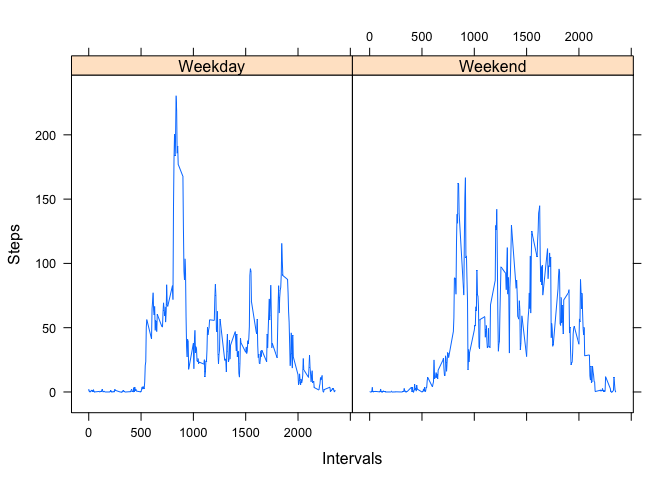
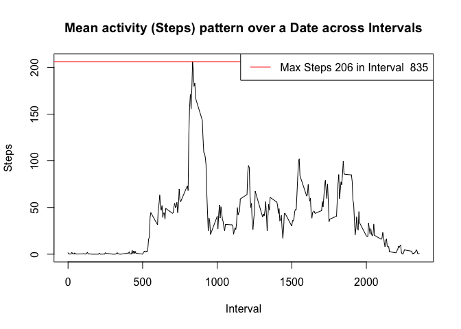
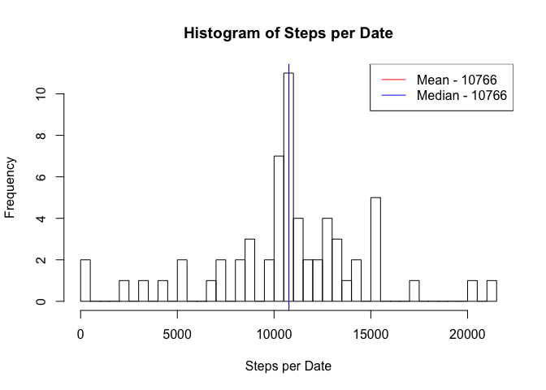
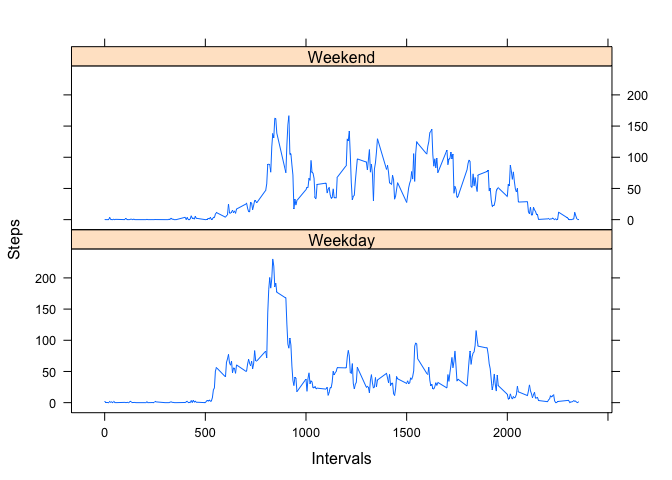

# Reproducible Research: Peer Assessment 1
Tobias Ford  
`r Sys.Date()`  


## Loading and preprocessing the data

- Remove all objects from the workspace 
- Unzip data source 
- Read data into a data.frame with read.csv 


```r
rm(list=ls())
unzip("activity.zip")
df <- read.csv("activity.csv")
str(df)
```

```
## 'data.frame':	17568 obs. of  3 variables:
##  $ steps   : int  NA NA NA NA NA NA NA NA NA NA ...
##  $ date    : Factor w/ 61 levels "2012-10-01","2012-10-02",..: 1 1 1 1 1 1 1 1 1 1 ...
##  $ interval: int  0 5 10 15 20 25 30 35 40 45 ...
```

```r
summary(df$steps)
```

```
##    Min. 1st Qu.  Median    Mean 3rd Qu.    Max.    NA's 
##    0.00    0.00    0.00   37.38   12.00  806.00    2304
```
Note: Number of NA's in the step field is 2304.

- Make Date field usable by converting from factor into Date 


```r
df$date <- as.Date(df$date, format="%Y-%m-%d")
str(df)
```

```
## 'data.frame':	17568 obs. of  3 variables:
##  $ steps   : int  NA NA NA NA NA NA NA NA NA NA ...
##  $ date    : Date, format: "2012-10-01" "2012-10-01" ...
##  $ interval: int  0 5 10 15 20 25 30 35 40 45 ...
```
Note: df$date field is now Date type

## What is mean total number of steps taken per day?

- Aggregate data based on sum of steps per date, making NA's into 0s


```r
dfa_date <- aggregate(steps ~ date, data=df, FUN=sum, na.rm=T, na.action=NULL)
summary(dfa_date$steps)
```

```
##    Min. 1st Qu.  Median    Mean 3rd Qu.    Max. 
##       0    6778   10400    9354   12810   21190
```

- Calculate the mean and median for steps per date


```r
dfa_date_mean <- round(mean(dfa_date$steps))
dfa_date_median <- median(dfa_date$steps)
```

Note: Mean rounds down to 9354 and Median is 10395.
Why isn't this the same as the output of summary?

- Plot a histogram of the steps 
- Add in lines and legend entries to represent the mean and median


```r
hist(dfa_date$steps,
     breaks=dim(dfa_date)[1],
     xlab="Steps per Date", main="Histogram of Steps per Date")

abline(v=dfa_date_mean, col="red")
abline(v=dfa_date_median, col="blue")

legend('topright',
       legend=c(paste('Mean -', dfa_date_mean), 
                paste('Median -', dfa_date_median)),
       col=c('red', 'blue'), lwd=1)
```

 

## What is the average daily activity pattern?

- Plot the aggregate of mean steps per internal, making NA's into 0s 


```r
dfa_interval <- aggregate(steps ~ interval, data=df, FUN=mean, na.rm=T, na.action=NULL)
str(dfa_interval)
```

```
## 'data.frame':	288 obs. of  2 variables:
##  $ interval: int  0 5 10 15 20 25 30 35 40 45 ...
##  $ steps   : num  1.717 0.3396 0.1321 0.1509 0.0755 ...
```

```r
plot(steps ~ interval, data=dfa_interval, type='l',
     xlab="Interval", ylab="Steps", main="Mean activity (Steps) pattern over a Date across Intervals" )

abline(h=max(dfa_interval$steps), col='red')

legend('topright',
       legend=c(paste('Max Steps', round(max(dfa_interval$steps)) ,
                      'in Interval ', dfa_interval[which.max(dfa_interval$steps), ]$interval)),
       col=c('red'), lwd=1)
```

 

## Imputing missing values

Note: Number of NA's in the step field is 2304.


```r
sum(is.na(df$steps))
```

```
## [1] 2304
```

Impute Strategy: Impute missing values by replacing NA's with the mean for that interval

- Merge/Join original data frame with mean steps per interval data frame based on interval

```r
df_imputed <- merge(x=df, y=dfa_interval, by="interval", all.x=T)
summary(df_imputed$steps.x)
```

```
##    Min. 1st Qu.  Median    Mean 3rd Qu.    Max.    NA's 
##    0.00    0.00    0.00   37.38   12.00  806.00    2304
```

```r
head(df_imputed, 2)
```

```
##   interval steps.x       date  steps.y
## 1        0      NA 2012-10-01 1.716981
## 2        0       0 2012-11-23 1.716981
```
- Replace the steps entries from the original data frame with the NA's with the steps field from the interval data frame


```r
df_imputed[is.na(df_imputed$steps.x), c("steps.x")] <- df_imputed[is.na(df_imputed$steps.x), c('steps.y')]
summary(df_imputed$steps.x)
```

```
##    Min. 1st Qu.  Median    Mean 3rd Qu.    Max. 
##    0.00    0.00    0.00   37.38   27.00  806.00
```

```r
head(df_imputed, 2)
```

```
##   interval  steps.x       date  steps.y
## 1        0 1.716981 2012-10-01 1.716981
## 2        0 0.000000 2012-11-23 1.716981
```

- Make a histogram of the aggregated sum of the steps per date

```r
dfa_imputed <- aggregate(steps.x ~ date, data=df_imputed, FUN=sum)
summary(dfa_imputed$steps.x)
```

```
##    Min. 1st Qu.  Median    Mean 3rd Qu.    Max. 
##      41    9819   10770   10770   12810   21190
```

```r
dfmean <- round(mean(dfa_imputed$steps.x)); dfmedian <- round(median(dfa_imputed$steps.x))

hist(dfa_imputed$steps.x, breaks=dim(dfa_imputed)[1],
     xlab="Steps per Date", main="Histogram of Steps per Date")

abline(v=dfmean, col="red"); abline(v=dfmedian, col="blue")

legend('topright',
       legend=c(paste('Mean -', dfmean), 
                paste('Median -', dfmedian)),
       col=c('red', 'blue'), lwd=1)
```

 

## Are there differences in activity patterns between weekdays and weekends?

- Add new field delineating each day a weekend or weekday


```r
df_imputed$weekend <- as.factor(ifelse(weekdays(df_imputed$date) %in% c("Saturday", "Sunday"), "Weekend", "Weekday"))
head(df_imputed,3)
```

```
##   interval  steps.x       date  steps.y weekend
## 1        0 1.716981 2012-10-01 1.716981 Weekday
## 2        0 0.000000 2012-11-23 1.716981 Weekday
## 3        0 0.000000 2012-10-28 1.716981 Weekend
```

- Plot the aggregate data based on steps per interval for which type of date it is, weekend or weekday
- Use the lattice package to make it look more like the example


```r
dfa_imputed_we <- aggregate(x=df_imputed$steps.x, by=list(df_imputed$interval, df_imputed$weekend), FUN=mean)
str(dfa_imputed_we)
```

```
## 'data.frame':	576 obs. of  3 variables:
##  $ Group.1: int  0 5 10 15 20 25 30 35 40 45 ...
##  $ Group.2: Factor w/ 2 levels "Weekday","Weekend": 1 1 1 1 1 1 1 1 1 1 ...
##  $ x      : num  2.251 0.445 0.173 0.198 0.099 ...
```

```r
library(lattice)
xyplot(x~ Group.1 | Group.2, data=dfa_imputed_we, type='l',
       xlab="Intervals", ylab="Steps", layout = c(1,2)
)
```

 
