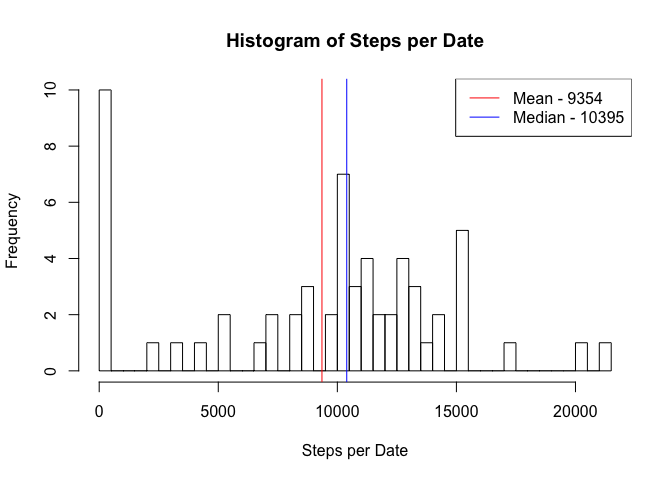

# Reproducible Research: Peer Assessment 1


## Loading and preprocessing the data

- Remove all objects from the workspace
- Unzip data source
- Read in data with read.csv
- Make date field usable
- Aggregate data based on sum of steps per day, making NA's into 0s


```r
rm(list=ls())
unzip("activity.zip")
df <- read.csv("activity.csv")
df$Date <- as.Date(df$date, format="%Y-%m-%d")
dfa <- aggregate(steps ~ Date, data=df, FUN=sum, na.rm=T, na.action=NULL)
```

## What is mean total number of steps taken per day?

- Plot a histogram of the steps 
- Add in lines and legend entries to represent the me


```r
hist(dfa$steps, breaks=dim(dfa)[1])
dfmean <- round(mean(dfa$steps))
dfmedian <- round(median(dfa$steps))

abline(v=dfmean, col="red")
abline(v=dfmedian, col="blue")

legend('topright', legend=c(paste('Mean -', dfmean), paste('Median -', dfmedian)), col = c('red', 'blue'), lwd=1)
```

 

## What is the average daily activity pattern?


```r
dfa_intervals <- aggregate(steps ~ interval, data=df, FUN=mean, na.rm=T, na.action=NULL)
plot(steps ~ interval, data=dfa_intervals, type='l')
abline(h=max(dfa_intervals$steps), col='red')

legend('topright', legend=c(paste('Max Steps ', round(max(dfa_intervals$steps)) , 'in interval -', dfa_intervals[which.max(dfa_intervals$steps), ]$interval)))
```

 

## Imputing missing values


```r
sum(is.na(df$steps))
```

```
## [1] 2304
```

```r
dfi <- merge(x=df, y=dfa_intervals, by="interval", all.x=T)
dfi[is.na(dfi$steps.x), c("steps.x")] <- dfi[is.na(dfi$steps.x), c('steps.y')]

dfai <- aggregate(steps.x ~ Date, data=dfi, FUN=sum)
hist(dfai$steps.x, breaks=dim(dfai)[1])

dfmean <- round(mean(dfai$steps.x))
dfmedian <- round(median(dfai$steps.x))

abline(v=dfmean, col="red")
abline(v=dfmedian, col="blue")

legend('topright', legend=c(paste('Mean -', dfmean), paste('Median -', dfmedian)), col = c('red', 'blue'), lwd=1)
```

 

## Are there differences in activity patterns between weekdays and weekends?


```r
dfi$weekend <- as.factor(ifelse(weekdays(dfi$Date) %in% c("Saturday", "Sunday"), "Weekend", "Weekday"))

dfiaw <- aggregate(x=dfi$steps.x, by=list(dfi$interval, dfi$weekend), FUN=mean)

library(lattice)
xyplot(x~ Group.1 | Group.2, data=dfiaw, type='l', xlab="Intervals", ylab="Steps")
```

 
